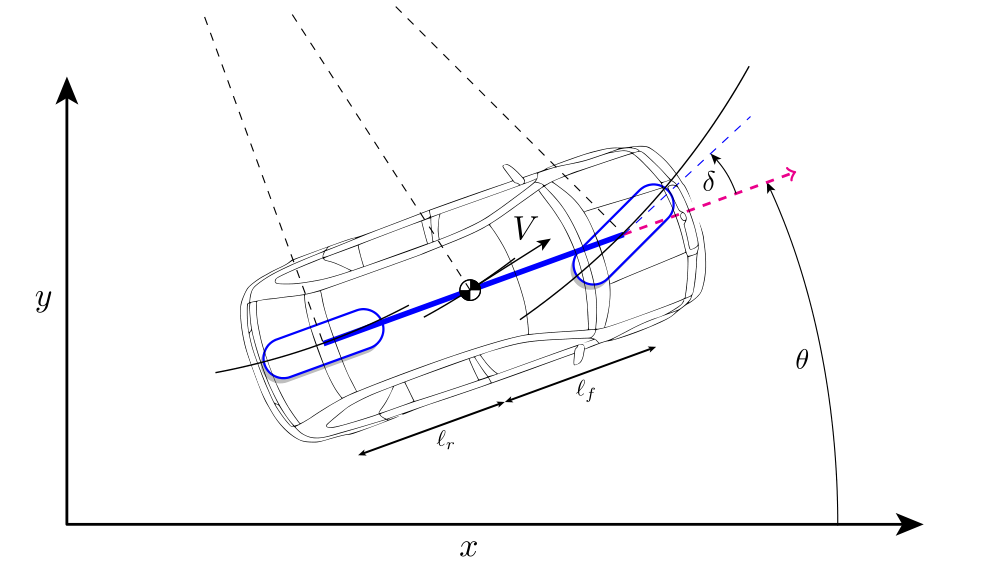

# ME-425 Model Predictive Control Mini-Project: Car Cruise Controller

 <!-- Add a relevant figure if available -->

## 📖 Project Description
This project involves designing a Model Predictive Control (MPC) cruise controller for a car on a highway. The controller is developed in MATLAB and includes:
- **Linearized subsystem controllers** (longitudinal and lateral dynamics).
- **Offset-free tracking** to eliminate steady-state errors.
- **Robust Tube MPC** for adaptive cruise control with collision avoidance.
- **Nonlinear MPC** for full-state control and overtaking maneuvers.

The project is divided into six parts, covering system dynamics, linearization, constraint handling, disturbance rejection, robustness, and nonlinear optimization for overtaking.

---

## 🛠 Installation Guide

### Prerequisites
- **MATLAB** (R2021a or later).
- **Required Toolboxes**:
  - Optimization Toolbox
  - Control System Toolbox
- **Third-Party Libraries**:
  - [YALMIP](https://yalmip.github.io/)
  - [MPT3](https://www.mpt3.org/)
  - [CasADi](https://web.casadi.org/) (v3.5.5 or later)
  - [Gurobi](https://www.gurobi.com/) (Optional, but recommended for faster optimization)

### Setup Steps
1. **Install MATLAB Toolboxes**: Ensure Optimization and Control System Toolboxes are installed.
2. **Install Third-Party Libraries**:
   - Download and add YALMIP and MPT3 to MATLAB's path.
   - Install CasADi via MATLAB's `install_CasADi.m` script (included in the repository).
   - Install Gurobi (optional) and set up a valid license（included in the repository）.
3. **Clone the Repository**:
   ```bash
   git clone https://github.com/zju7fdu/MPC-Controllers-for-Autonomous-Driving-Conditions.git
   